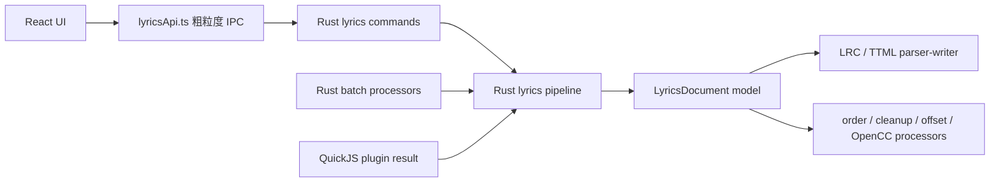

# Lyrico Desktop 实施计划与新对话交接

> 最后整理：2026-07-14
>
> 桌面端仓库：`E:\Lyrico-Desktop`
>
> 移动端行为基准：`E:\Lyrico`
>
> 移动端插件及测试工具：`E:\Lyrico\Lyrico-Plugins`

## 0. 新对话接手说明

新对话不要从零设计，也不要只根据本文件中的勾选项推测代码已经完成。接手后按以下顺序开始：

1. 读取本文件，先看“当前快照”“不可回退的产品约束”和“下一阶段执行顺序”。
2. 运行 `git status --short`，保护用户已有修改；不要重置、覆盖或清理不属于当前任务的改动。
3. 对照实时代码和移动端实现确认入口，尤其不要把旧 Flutter 仓库 `E:\lyrico_desktop` 与当前 Tauri/React 仓库混淆。
4. 修改前运行与目标模块相关的测试；修改后至少运行第 9 节的统一验证。
5. 每完成一项立即更新本文件：只有实现、测试和对应验收证据齐全才能标记为 `[x]`。

推荐新对话开场任务：

> 继续 `E:\Lyrico-Desktop\IMPLEMENTATION_PLAN.md`。M2-R 歌词核心 Rust 化的代码迁移与生成链删除已完成，只剩按需补做 release 体积/吞吐记录；下一项实施 M2 其余批处理器。开始前检查实时工作区、暂存区和移动端对应实现，不要重做已完成项，并在每个阶段后更新计划与运行验证。

## 1. 当前真实快照

### 1.1 技术栈与持久化决策

- 前端：React 19、TypeScript、Ant Design、Vite。
- 桌面端：Tauri 2、Rust。
- 歌词架构已完成 M2-R 迁移：`src-tauri/src/lyrics/` 是解析、转换和编码的唯一业务核心，React 通过 `src/backend/lyricsApi.ts` 进行粗粒度 IPC；批处理直接调用同一 Rust pipeline，不再生成或嵌入 `lyrics_runtime.js`。
- QuickJS 仍是第三方插件执行所必需的隔离运行时；M2-R 只移除“歌词核心再嵌一份 JavaScript bundle”的路径，不把插件脚本强行改写成 Rust。
- 音频标签：当前使用 Lofty；只有完成格式兼容测试后才决定是否切换到移动端同款 TagLib。
- 业务索引：保留 SQLite，启用 WAL、外键、事务和 schema version；不再尝试引入构建成本过高的 RocksDB。
- 人工可迁移配置：使用 JSON；数据库不能被 JSON 替代。
- 数据目录：当前由 Tauri `app_local_data_dir` 解析。用户已明确“安装目录实现麻烦可保持现状”，所以不要把便携目录当作阻塞项，也不要宣称当前已实现安装目录优先。
- 音频文件是标签、歌词、封面和 ReplayGain 的最终事实来源；数据库只保存可查询摘要、关系、插件和任务状态。

### 1.2 最近一次验证证据

2026-07-14 M2-R 阶段 5 完成后的最近一次完整验证：

- `npx tsc --noEmit`：通过。
- `npm test`：删除双实现后 12 项通过；迁移前 oracle 尚在时 41 项通过，删除前 TypeScript/Rust 共享 fixture 19 项差分通过。
- `npm run build`：删除生成链后连续运行两次均通过，工作区指纹前后完全一致；仅保留 Vite 大 chunk 警告。
- `cargo test --manifest-path src-tauri/Cargo.toml`：34 项通过，2 项环境测试按默认忽略；共享歌词 fixture 19 项由 Rust 独立读取并通过。
- `cargo check --manifest-path src-tauri/Cargo.toml`：通过。
- `git diff --check`：通过。
- 本地浏览器运行态已检查恢复后的批处理“处理器工具栏 + 单操作面板”结构；浏览器环境没有 Tauri IPC，因此任务执行证据以 Rust 测试和真实音频测试副本为准。

这些结果只是当前基线；新对话修改后必须重新运行，不能直接引用为新改动的验证证据。

### 1.3 关键代码入口

| 范围 | 桌面端入口 | 移动端参考 |
|---|---|---|
| 应用状态与页面装配 | `src/app/App.tsx` | 对应 ViewModel/导航流程 |
| 单曲编辑器 | `src/components/SongDetails.tsx` | `EditFieldRegistry`、歌曲编辑页面 |
| 歌词核心 | `src-tauri/src/lyrics/` | `LyricsDocumentPipeline.kt`、`LrcDocumentFormat.kt`、`TtmlDocumentFormat.kt`、移动端 processors |
| 歌词 IPC | `src-tauri/src/lyrics_commands.rs`、`src/backend/lyricsApi.ts` | 完整歌词/插件结果的粗粒度调用 |
| 歌词回归测试 | `src/domain/fixtures/lyricsPipelineCases.json`、Rust pipeline tests | 移动端歌词管线测试集 |
| 插件页面 | `src/pages/PluginsPage.tsx` | 移动端插件管理流程 |
| 插件运行时 | `src-tauri/src/plugins/` | `E:\Lyrico\Lyrico-Plugins` 与移动端 Host API |
| 批处理页面 | `src/pages/TasksPage.tsx` | 移动端批处理页面、Worker、ViewModel |
| ReplayGain | `src-tauri/src/replay_gain.rs` | 移动端 ebur128/批处理实现 |
| 进度订阅 | `src/hooks/useReplayGainProgress.ts` | 移动端任务 Flow/WorkManager |
| 扫描与命令 | `src-tauri/src/commands.rs` | 移动端媒体库扫描逻辑 |
| 数据库 | `src-tauri/src/database.rs` | 移动端实体/Repository 作为语义参考 |
| 可调列宽 | `src/hooks/useResizableColumns.tsx` | 桌面端专属 |
| 设置 | `src/pages/SettingsPage.tsx`、`src-tauri/src/config.rs` | 移动端设置项 |

### 1.4 当前 Rust 模块化边界

Rust 已从单文件抽出 `audio.rs`、`commands.rs`、`config.rs`、`database.rs`、`models.rs`、`paths.rs`、`replay_gain.rs` 和 `plugins/`，但拆分尚未完成：

- `commands.rs` 约 831 行，仍混合扫描、标签、ReplayGain 和批处理 command。
- `database.rs` 约 1150 行，schema、迁移和多个 Repository 仍在同一文件。
- `plugins/installer.rs` 与 `plugins/runtime.rs` 均超过 600 行，后续新增 Host API 前需要按职责拆分。
- 歌词处理已拆为独立 `lyrics/` 领域核心；`batch/lyrics.rs` 只保留批处理配置与音频文件写入，歌词语义不依赖批处理或 QuickJS。

因此原需求“Rust 代码合理分配”状态为**部分完成**，不得在新对话中宣称已经收尾。

## 2. 不可回退的产品约束

后续实现必须保留以下已经确认的语义：

1. UI 术语使用“插件源”“批处理”“注释”，不退回“数据源”“任务”“备注”。
2. 不使用分页；大列表使用单一滚动区域、虚拟化或其他不会切断选集的策略。
3. 歌曲页右上角不放不明确目标的“编辑标签”按钮；任何单曲 Item 点击都必须打开该文件的编辑器。
4. 专辑/艺术家集合 Drawer 打开单曲编辑器时，编辑器必须处于最上层，不能被集合视图遮挡。
5. 任意含歌曲 Item 的列表都可进入多选；专辑/艺术家主列表勾选代表加入该集合的全部歌曲，详情仍支持逐首勾选。
6. 侧边栏“已选歌曲”位于折叠按钮上方，支持查看、移除、清空和进入批处理，不维护第二份选集状态。
7. 空标签值表示用户要删除该字段；缺失请求字段表示协议错误或未挂载字段保留原值，Rust 不得自作主张填默认值。
8. 在线匹配默认搜索所有已启用插件，使用“全部 + 各插件源”Tab；单源失败不能清空其他源结果。
9. 搜索结果的标签、封面、歌词是三个独立操作：
   - 标签：逐字段勾选，每行独立覆盖/补充；顶部提供全选和批量策略。
   - 封面：调整目标图片大小，不允许修改来源 URL 冒充封面编辑。
   - 歌词：支持普通 LRC、逐字 LRC、增强 LRC、TTML 切换和确认前编辑。
10. 插件返回结果只进入编辑器临时状态；确认保存后才写音频文件。
11. ReplayGain 必须使用 ebur128：目标响度 `-18 LUFS`，曲目响度使用 integrated/global loudness，峰值使用 true peak，禁止用 RMS 或平均 LUFS 替代。
12. 扫描、插件、封面和批处理不能阻塞前端事件循环；任务切页后仍可观察。
13. 不在媒体库数据库中保存完整 base64 封面；列表只加载缩略图，原图按需读取。
14. 设置必须真实影响行为，不能为了页面存在而保留无效设置或静态摘要。
15. 歌词解析、格式转换、轨道处理、简繁转换和编码以 Rust 为唯一业务核心；前端只保留展示状态、用户输入和粗粒度 IPC 调用。不得保留 TypeScript 与 Rust 两套会独立演进的歌词语义，也不得让 Cargo 编译依赖源码目录中的已生成 JavaScript 文件。

## 3. 已实现基线

本节只列可继续复用的基线，不代表相关大阶段已经全部完成。

### 3.1 媒体库与通用交互

- [x] 歌曲、专辑、艺术家和批处理表格取消分页。
- [x] 应用级单曲编辑 Drawer；专辑、艺术家和文件夹详情中的单曲可打开正确编辑器。
- [x] 打开编辑器前关闭集合 Drawer，修复编辑器被压在单曲列表下方。
- [x] 移除歌曲页不明确目标的编辑按钮。
- [x] 替换 WebView 默认浏览器右键菜单。
- [x] 封面请求合并、批量去重、有限重试、视口预取和失败缓存失效。
- [x] 应用级选集、主列表集合多选、详情逐首多选和侧边栏已选歌曲抽屉。
- [x] 歌曲/专辑/艺术家列表头部及多选按钮位置完成第一轮统一。

### 3.2 数据、扫描与配置

- [x] SQLite Repository 基线、WAL、外键、busy timeout、事务和 `user_version`。
- [x] 媒体库关系、插件、插件缓存、批处理、任务项和日志表基线。
- [x] JSON 设置、原子替换、备份以及旧设置迁移基线。
- [x] 当前统一使用 Tauri `app_local_data_dir`；安装目录便携模式按用户确认暂不作为必做项。
- [x] 扫描放入后台线程，分为枚举、读标签、索引提交；最多 4 线程有界并发。
- [x] `path + size + mtime + scan signature` 增量判断和重复扫描拒绝。
- [x] Shell 应用级扫描进度。

### 3.3 插件系统

- [x] 移动端 API v3 manifest 基本校验、ZIP 路径安全和原子安装。
- [x] QuickJS 独立上下文、同插件串行、内存/栈/超时限制和隔离缓存。
- [x] `includeDirs` 与入口加载顺序。
- [x] `searchSongs/getLyrics/searchCovers`、标准字段及私有 `internal` 透传。
- [x] text/password/number/switch/dropdown/textarea/markdown 配置字段和依赖表达式。
- [x] 插件配置 Markdown 安全渲染；配置/清单 Tab；图标 Data URL；启停/卸载统一布局。
- [x] 兼容 manifest 中 boolean/number/null 标量默认值，修复 QQ 插件安装失败。
- [x] 修复 `bodyBytes: null` 覆盖正常 JSON body 导致 QQ 搜索返回空结果。
- [x] 编辑器默认并发搜索所有源，“全部 + 单源”Tab 和独立标签/封面/歌词确认对话框。

### 3.4 编辑器与歌词

- [x] 本地标签、在线匹配和文件信息 Tab；技术参数拆分为格式、时长、码率、采样率和声道数。
- [x] 封面右侧只保留替换、同专辑、导出、移除和还原操作。
- [x] 注释改为真实单行输入；删除“歌词已找到”“封面已内嵌”等无效状态。
- [x] 多值/手动输入流派；composer、lyricist、copyright、rating、language 第一轮读写。
- [x] 本地封面替换、移除、还原、同专辑复用和导出。
- [x] 歌词文件导入导出、时间偏移、移除空行和纯文本预览第一阶段。
- [x] 插件歌词使用统一 `LyricsDocument`，不再用单个正则直接拼接四种格式；M2-R 已在保持移动端语义的前提下迁到 Rust 唯一核心。
- [x] 修复逐字 LRC 最后一个字丢失、TTML `1.5s` 等时间表达失败、翻译按数组下标错配和逐字空格丢失。
- [x] 保存请求使用完整快照：显式空值删除，未挂载字段不被错误清空。

### 3.5 批处理、ReplayGain 与设置

- [x] 批处理页删除无效说明、占位统计和假历史页；未实现操作禁用。
- [x] SQLite 任务/任务项状态 API 基线和 ReplayGain 第一条真实执行链路。
- [x] Symphonia 流式解码并将交错 PCM 交给 `ebur128`，写入 track gain/peak。
- [x] ReplayGain 取消、跳过已有字段、成功/失败/取消状态记录。
- [x] Rust 运行进度最多每 100 ms 推送一次；前端独立进度存储最多每 160 ms 更新一次。
- [x] Shell 和当前编辑器局部订阅 ReplayGain 进度；应用根组件与批处理表格不再随每个 PCM 进度重渲染。
- [x] 歌词格式化由 Rust runner 直接调用 Rust `lyrics` pipeline，写入后重新读取文件；不再生成或嵌入 TypeScript 运行时。
- [x] 设置页左侧分类，删除静态占位内容；搜索数量和歌词格式/翻译/罗马音设置已真实接入行为。

## 4. 下一阶段执行顺序

当前 M1 已完成、M2-R 的代码迁移与生成链删除已完成、M2 部分完成。下一步按 **M2-R 可选性能记录 → M2 剩余处理器 → M3 → M4 → M5 → M6** 实施；每个阶段必须可独立验收，禁止把核心迁移、UI 改造和其余批处理器混成不可审查的大改动。

### M1：完成移动端歌词管线对齐（已完成）

目标：本地歌词工具、插件歌词预览和批量歌词格式化共用一条结构化管线，不再出现同一歌词在不同入口解析结果不同。

- [x] 逐文件阅读移动端 `LyricsDocumentPipeline`、LRC/TTML parser/writer、processors 和测试，不凭记忆补语义。
- [x] 将 `src/domain/lyrics.ts` 中仍以正则处理的偏移、空行清理等逻辑迁移到统一 `LyricsDocument` processors。
- [x] 移植逐句排序和原文/翻译/罗马音显示顺序。
- [x] 移植非歌词内容/标签行过滤，并保证删除原文时同步删除关联翻译和罗马音。
- [x] 移植仅翻译策略、空行策略和简繁转换。
- [x] 将简繁转换模式接入桌面设置持久化和插件歌词预览，不再停留在未传参的管线内部能力。
- [x] 对齐 Apple TTML localization：同语系中文 replacement 替换正文并移除已消费翻译，跨语系 subtitle 保留；判断继续由移动端同源插件负责，不在通用 TTML 管线误删中文翻译。
- [x] 保留 TTML agent、`itunes:key`、翻译语言、罗马音、背景和声、文本节点空格及已知扩展。
- [x] 对未知 TTML 扩展定义明确策略：同格式无处理时原文透传；跨格式通过 `LyricsPipelineResult.warnings` 记录不可表达的命名空间信息，而不是静默丢失。
- [x] 将移动端歌词管线关键测试移植到桌面端，至少覆盖：
  - 最后一个逐字结束时间；
  - 行级歌词降级；
  - metadata translation；
  - agent/key/translation 关联；
  - 背景和声；
  - 空原文与关联轨道删除；
  - LRC ↔ TTML 往返；
  - TTML `ms/s/秒数/HH:MM:SS/MM:SS`；
  - 文本节点空格与 timed space。
- [x] 插件歌词预览和本地歌词按钮只调用统一入口；已导出 processor 契约和同源夹具。M2 尚未接入的 Rust 批量歌词处理器必须复用这些夹具与语义，不得新增正则路径。

验收：使用移动端同一测试夹具转换四种格式，文本、时间和轨道关系无意外丢失；`npm test` 与 `npm run build` 通过。

2026-07-13 M1 验证证据：`npm test` 27 项通过；`npm run build` 通过（仅保留既有大 chunk 警告）；`cargo test --manifest-path src-tauri/Cargo.toml` 20 项通过、1 项联网插件测试按环境忽略；`cargo check --manifest-path src-tauri/Cargo.toml` 与 `git diff --check` 通过。新增测试覆盖移动端 TTML/LRC 夹具、轨道顺序、关联删除、标签行过滤、OpenCC 简繁转换、统一 offset、全部移动端时间表达和跨格式扩展告警。

2026-07-13 M1 TTML localization 纠偏验证证据：确认问题不是通用 TTML parser 漏掉一个过滤条件，而是桌面插件运行时缺少移动端 `xml.getRootAttributes/findElements/replaceChildrenByAttr/removeElements` 四项 Host API，导致 Apple 插件主动跳过 localization；另确认 OpenCC 处理器已存在但桌面设置和 `SongDetails` 未传 `conversionMode`。现已补齐 Rust XML 模块、QuickJS `Platform.xml` 暴露、supportedHostApis、简繁设置持久化及预览传参。`npm test` 29 项、`npm run build`、`cargo test` 29 项（2 项环境测试默认忽略）、`cargo check`、`cargo fmt --check` 与 `git diff --check` 通过；Apple 专项测试显式加载移动端原始 `E:\Lyrico\Lyrico-Plugins\apple\lib\01_apple_api.js`，验证中文同语系无 type translation 被替换/去重、英文正文的中文 translation 保留，并覆盖 XML 实体/属性转义。设置页三种转换选项与原批处理单面板已在 `http://127.0.0.1:1420/` 实际检查。

### M2-R：歌词核心 Rust 化与前端瘦身（新增，最高优先级）

#### 背景与结论

迁移前，`src/domain/pluginLyrics.ts` 同时承担歌词领域模型、LRC/TTML parser/writer、轨道关联、清理、偏移和 OpenCC 转换。前端直接执行它；Rust 的歌词批处理与标签匹配则通过 `src/domain/batchLyricsRuntime.ts` + esbuild 生成 `src-tauri/src/batch/lyrics_runtime.js`，再由 `batch/lyrics.rs` 使用 `include_str!` 嵌入并交给 QuickJS。

这套结构的出发点是复用已完成的 TypeScript 行为、避免立即维护第二份实现，**不是性能优化**。它现已暴露以下问题：

- `npm run build` 会改写被 Git 跟踪的 Rust 源码目录文件，普通构建产生业务 diff。
- `cargo test/check/build` 只会消费 `include_str!` 文件，不会先运行 npm/esbuild；文件缺失时直接编译失败。
- JavaScript 生成物与 TypeScript 源码可能失配。2026-07-14 实查：当前提交中的完整 bundle 约 2.3 MB，而工作区已暂存的约 105 KB 版本缺少 `__lyricoRenderPluginLyrics` 入口；这说明不能把生成物当成可靠源码。
- 同一复杂核心同时进入前端 bundle 和 Rust/QuickJS，增加体积、构建耦合、运行时初始化与故障面。
- Rust 后台批处理本应直接调用领域服务，却需要序列化 JSON、启动 QuickJS、执行 JS、再反序列化结果。

目标架构是：**Rust 持有唯一歌词业务核心，React/TypeScript 只负责 UI、输入收集、结果展示和粗粒度 IPC；插件脚本继续运行在独立 QuickJS 沙箱。**

#### 目标模块边界

| 层 | 目标职责 | 禁止事项 |
|---|---|---|
| `src-tauri/src/lyrics/model.rs` | `LyricsDocument`、track/line/word、format/options/result | 不依赖 Tauri、文件系统或批处理状态 |
| `src-tauri/src/lyrics/lrc.rs` | Plain/Verbatim/Enhanced LRC 解析与编码 | 不直接写音频文件 |
| `src-tauri/src/lyrics/ttml.rs` | TTML 解析与编码、metadata/agent/key/translation/background 关联 | 不把未知扩展静默当作已支持 |
| `src-tauri/src/lyrics/processors.rs` | 行序、仅翻译、空行/标签行过滤、偏移、空白规范化、简繁转换 | 不包含页面设置读取 |
| `src-tauri/src/lyrics/pipeline.rs` | 格式识别、来源选择、raw/structured 适配、处理器编排、warnings | 不启动 QuickJS |
| `src-tauri/src/commands/lyrics.rs` 或等价薄 command | 参数校验、`spawn_blocking`、返回可序列化结果 | 不复制 parser/writer 逻辑 |
| `src/backend/lyricsApi.ts` | 类型声明和粗粒度 Tauri invoke | 不解析 XML/LRC、不加载 OpenCC 词典 |
| React 组件/hooks | 编辑状态、防止过期响应覆盖、错误与 loading 展示 | 不在渲染阶段执行重转换 |

`rquickjs` 依赖不能因为本里程碑被整体删除：插件系统仍需要它执行第三方 JavaScript。只删除歌词专用 bundle、歌词专用全局入口和 `batch/lyrics.rs` 中的第二层 QuickJS 调用。

#### 分阶段实施

1. [x] **冻结行为基线与差分夹具**
   - 将移动端 `LyricsDocumentPipelineTest` 与当前 `pluginLyrics.test.ts` 的输入/期望整理成与语言无关的 JSON/golden fixtures。
   - 覆盖 raw 和 structured 插件结果、四种格式、轨道顺序、未知 namespace warning、原文/翻译/罗马音/背景/agent/key、文本节点空格和全部时间表达。
   - 迁移期保留旧 TypeScript 管线作为测试 oracle；只允许测试调用，不再新增业务入口。
2. [x] **建立无 Tauri 依赖的 Rust 歌词 crate/module**
   - 先实现 model、格式识别、LRC parser/writer，再实现 TTML parser/writer 和 processors。
   - 简繁转换选择纯 Rust、内嵌词典、无外部动态库/运行时文件依赖的实现；落地前记录许可证、release 体积和 `t2s/s2tw` 与当前 OpenCC-JS 的夹具差异。
   - `process_text`、`process_plugin_result`、`extract_plain_text` 等核心 API 使用强类型参数；只在 IPC/插件边界接收 `serde_json::Value`。
3. [x] **先替换 Rust 后台消费者**
   - `batch/lyrics.rs` 直接调用 Rust pipeline，保留现有超时/取消点、写入后重读和 `LyricsPipelineResult` 契约。
   - `batch/metadata.rs` 的插件歌词渲染改调同一 Rust pipeline。
   - 删除 Rust 后台对 `__lyricoProcessBatchLyrics`、`__lyricoRenderPluginLyrics` 和嵌入式 `lyrics_runtime.js` 的依赖。
4. [x] **再迁移前端消费者**
   - 提供粗粒度 command：插件歌词渲染、本地歌词处理/偏移/空行清理、纯文本提取、格式识别；一次用户操作只做一次 IPC，不按行/字调用。
   - `SongDetails` 的插件歌词预览、导入导出判断和本地工具改用 `lyricsApi.ts`；为快速连续切换格式/插件源增加 request id 或取消机制，旧响应不得覆盖新选择。
   - 重任务使用 `spawn_blocking`；前端事件循环只更新 UI 状态，不执行 XML/OpenCC 转换。
5. [x] **删除双实现与生成链**
   - 删除 `src/domain/batchLyricsRuntime.ts`、`src-tauri/src/batch/lyrics_runtime.js` 及对应 npm `build:lyrics-runtime`。
   - 当前端无剩余调用后删除或缩减 `src/domain/pluginLyrics.ts`、`src/domain/lyrics.ts`；移除不再使用的 `@xmldom/xmldom`、`opencc-js` 和 `esbuild` 直接依赖。
   - `npm run build` 不得写入 `src-tauri/src/**`；`cargo test/check` 不得要求 Node、npm 或预先存在的生成文件。
6. [ ] **收口与性能核验**
   - 删除测试 oracle 前，Rust 对全部 golden fixtures 与旧 TypeScript/移动端期望逐项一致；对有意差异写明原因并新增回归测试。
   - 记录迁移前后前端 chunk、Rust release 体积、首次/重复转换耗时和批处理吞吐。性能数据用于发现退化，不以牺牲语义换取数字。
   - 确认连续运行两次 `npm run build`、`cargo test`、`cargo check` 后 Git 工作树不会因生成物发生变化。

2026-07-14 M2-R 阶段 1 验证证据：新增语言无关的 `src/domain/fixtures/lyricsPipelineCases.json`，12 个共享 case 覆盖 structured/raw、四种格式、行序、offset、全部移动端时间表达、关联轨道删除、未知 namespace warning、agent/key/translation/background、仅翻译、OpenCC、metadata 边界和同格式原文透传；`lyricsPipelineFixtures.test.ts` 使用当前 TypeScript 管线作为迁移 oracle。fixture 首次执行发现强制重写 TTML 时文本节点空格被并入前一个 timed span，已按移动端 writer 行为修复。随后逐行复核移动端 `TtmlParser/TtmlWriter`，确认移动端 TTML 只映射 `xml:lang`，不会把 LRC `ti/ar/al` 写成自定义 `lyrico:tag`；桌面端此前的私有 metadata 扩展、相关解析和错误测试已删除，fixture 明确锁定该边界。专项运行 `pluginLyrics.test.ts`、`lyrics.test.ts` 和共享 fixture 通过后方可进入 Rust 迁移。

2026-07-14 M2-R 阶段 2 验证证据：新增 `src-tauri/src/lyrics/`，按 `model/lrc/ttml/processors/pipeline` 拆分，核心不依赖 Tauri、数据库、文件系统、批处理或 QuickJS；Rust 测试通过 `include_str!` 直接读取同一份语言无关 fixture。共享 case 增至 12 个，补充 `simplifiedToTraditional` 台湾繁体路径；TypeScript oracle 12 项和 Rust pipeline 12 项全部通过。OpenCC 选型先否决了会把 Rayon 精确锁到 1.10、与项目 1.11 冲突的 `opencc-fmmseg`，改用 Apache-2.0、纯 Rust、内嵌配置且不依赖 Rayon 的 `ferrous-opencc 0.3.1`；`T2s/S2tw` 均由共享 fixture 校验。XML 使用 MIT/Apache-2.0 的只读 `roxmltree 0.21.1`，不引入系统动态库。

2026-07-14 M2-R 阶段 3 验证证据：`batch/lyrics.rs` 的歌词格式化与 `batch/metadata.rs` 的插件歌词渲染已直接调用 `crate::lyrics`；歌词后台路径删除 `include_str!("lyrics_runtime.js")`、歌词专用 QuickJS `Runtime/Context`、`__lyricoProcessBatchLyrics/__lyricoRenderPluginLyrics` 和 JS JSON 往返。移动端大写枚举兼容、关联标签行过滤、OpenCC 插件歌词与格式转换 4 个后台专项测试通过，共享 Rust fixture 再次通过。`rquickjs` 仍由第三方插件沙箱使用，未扩大本阶段范围。

2026-07-14 M2-R 阶段 4 验证证据：新增 `lyrics_commands.rs` 与 `src/backend/lyricsApi.ts`，按完整歌词或完整插件结果提供插件歌词渲染、本地处理、纯文本提取和格式识别四个粗粒度命令，CPU 工作均由 `spawn_blocking` 执行。`SongDetails` 的在线歌词预览、格式切换、本地 offset、空行清理和纯文本预览，以及 `App` 的导出扩展名判断均已切到 Rust；连续格式切换使用递增 request id，过期响应不会覆盖当前选择。前端生产代码已无 `domain/pluginLyrics` 或 `domain/lyrics` 调用。`npm run build` 与 `cargo check` 通过，随后完整 `npm test` 41 项通过、`cargo test` 33 项通过且 2 项环境测试按既有约束忽略。构建同时再次验证旧 `build:lyrics-runtime` 会无意义改写已不再使用的生成物，因此按计划进入阶段 5 删除生成链。

2026-07-14 M2-R 阶段 5 验证证据：删除 TypeScript 歌词领域实现、测试 oracle、`batchLyricsRuntime.ts` 和 `lyrics_runtime.js`，移除 npm `build:lyrics-runtime` 以及 `@xmldom/xmldom`、`opencc-js`、`esbuild` 三项直接依赖；`esbuild` 若由 Vite 间接使用不属于歌词生成链。删除 oracle 前将其剩余关键场景补入共享 fixture，case 从 12 增至 19，TypeScript 与 Rust 专项差分全部通过。删除后连续运行两次 `npm run build`，工作区指纹三次一致，证明 npm 构建不再写 Rust 源码目录；主前端 chunk 从迁移前 2,675.01 kB / gzip 992.97 kB 降为 1,396.58 kB / gzip 439.10 kB。在线插件源与格式切换、本地编辑期间的异步响应均使用请求版本隔离，导出格式识别错误也已纳入可见错误路径。

2026-07-14 M2-R 阶段 6 当前证据：最终静态与 debug 验证为 `npx tsc --noEmit` 通过、`npm test` 12 项通过、`cargo test` 34 项通过且 2 项环境测试按既有约束忽略、`cargo check`、`cargo fmt` 与 `git diff --check` 通过。release 体积和吞吐探针按用户指示停止等待，因此阶段 6 保持未勾选；这不是功能或架构迁移阻塞项，后续需要性能基线时再单独执行，禁止因此恢复旧生成链。

#### 验收与退出条件

- 四种歌词格式的文本、时间、轨道、关联键、metadata 和 warnings 达到 M1 同等或更完整覆盖。
- 批量歌词格式化、标签匹配取歌词、歌曲详情插件歌词预览、本地偏移/空行/纯文本/导入导出全部走 Rust 同一核心。
- Rust 后台不再为歌词启动 QuickJS；前端生产代码不再解析 TTML/LRC 或加载 OpenCC 词典。
- 删除 `lyrics_runtime.js` 后，`cargo test --manifest-path src-tauri/Cargo.toml` 与 `cargo check --manifest-path src-tauri/Cargo.toml` 可直接运行。
- `npm run build` 不修改任何已跟踪文件；构建前后 `git status --short` 仅包含用户原有改动。
- 插件 QuickJS 隔离、Host API 和第三方插件兼容性保持不变。

#### 非目标与迁移约束

- 本里程碑不重写第三方插件运行时，不把插件 JavaScript 转成 Rust。
- 不在迁移同时改歌词产品语义或 UI 结构；先保证行为等价，再单独讨论功能增强。
- 不长期保留 Rust/TypeScript 双核心或“失败时自动回退旧 JS”的隐藏分支；差分期结束后 Rust 是唯一事实来源。
- 不把高频逐行 IPC 当作前端瘦身；IPC 必须以完整歌词/完整插件结果为单位。

#### 2026-07-14 计划审查结论

- 已解决执行顺序冲突：不再要求重做已完成的 M1，M2-R 插在 M2 剩余处理器之前。
- 已解决完成状态冲突：M1/M2 的现有功能验证继续有效，但“嵌入式 TypeScript 运行时”明确标为待替换架构债务，未把功能完成错误改回未完成。
- 已解决 QuickJS 范围冲突：歌词核心退出 QuickJS，第三方插件沙箱继续保留，M3 插件兼容目标不受影响。
- 已解决前后端职责冲突：Rust 是唯一歌词语义核心；前端使用完整请求的粗粒度 IPC，并明确处理异步竞态。
- 已解决构建依赖冲突：最终状态不再跟踪/生成 `lyrics_runtime.js`，Cargo 测试不依赖 Node，npm 构建不写 Rust 源码目录。
- 已补齐迁移安全措施：先冻结同源 fixtures 和差分 oracle，再切后台、再切前端，最后删除旧实现；不存在无验证的一次性全量替换。

### M2：Rust 后台批处理运行器（运行器、ReplayGain 与歌词格式化已完成，其他处理器待接入）

目标：页面只创建任务和订阅快照；任务不由 React `for` 循环驱动，切页和界面重渲染不影响执行。

- [x] 在 Rust 建立 `batch/manager.rs`、`worker.rs` 和 processor 接口。
- [x] 从 SQLite 恢复 queued/running 任务；running 项与 running item 重置为 queued，保留已完成项，ReplayGain 依靠写后重读和已有字段跳过保证恢复幂等。
- [x] 实现 1–5 有界并发，默认 3，与移动端 Worker 一致。
- [x] 实现任务级/单项取消、单项错误隔离、失败项重试和结构化日志。
- [x] 将 ReplayGain 前端串行编排迁移到 Rust；前端只监听任务快照和当前文件进度，旧的前端状态写入 command 已从 IPC 暴露面移除。
- [x] 按用户确认保留原有“处理器工具栏 + 单操作面板”交互，不再用“新建批处理/历史记录”双 Tab、Card 和明细表替换主流程。
- [x] ReplayGain 保留原有选中歌曲表格、字段状态、开始/取消和当前任务进度；执行改由 Rust runner 驱动，默认并发 3 写入任务配置，切页不影响任务。
- [ ] 历史记录以后只通过不干扰主流程的次级入口接入；Rust 已具备状态快照、单项原因、失败重试和取消 API，当前不把完整历史表塞回主页面。
- [ ] 逐项接入移动端处理器：
  1. [x] 歌词格式化（功能已接入；TypeScript bundle/QuickJS 架构待 M2-R 替换）；
  2. [x] 标签匹配；
  3. [ ] 批量编辑；
  4. [ ] 重命名；
  5. [ ] 导出歌词；
  6. [ ] 导出封面；
  7. [x] ReplayGain 曲目模式；专辑模式仍待实现。
- [ ] 重命名支持 `@1`–`@8`、非法字符映射、冲突编号和执行前预览。
- [ ] 导出歌词保持 TTML `.ttml`、其他 `.lrc`；导出封面按原文件基名并处理冲突。
- [ ] 批处理进度与扫描进度合并到 Shell 全局任务中心。

验收：启动批处理后切换到任意页面仍持续执行；取消后不再写后续文件；重启可查看历史；失败项可单独重试。

2026-07-13 M2 运行器验证证据：Rust 单元测试覆盖默认/边界并发和 running 任务/单项重启恢复；`sinewave.flac` 测试副本通过真实 ebur128 分析与 ReplayGain 写后重读；前端已删除串行 `for` 编排与任务状态写入 IPC，只保留 create/start/cancel/retry/load。页面纠偏后 `npm test` 27 项、`cargo test` 22 项通过（1 项联网插件测试按环境忽略），`npm run build`、`cargo check` 与 `git diff --check` 通过。本地 `http://127.0.0.1:1420/` 已实际检查原处理器工具栏、单 ReplayGain 表格、禁用空选集启动按钮及无双 Tab/Card 结构。尚未完成的处理器、轻量历史入口、专辑 ReplayGain 和统一 Shell 任务中心继续保留未勾选，不能把 M2 整体宣称为全部完成。

2026-07-13 M2 歌词格式化验证证据：逐文件核对移动端 `LyricsFormatProcessor`、`BatchLyricsFormatViewModel` 和配置 Bottom Sheet；桌面端 `formatLyrics` processor 复用由 `src/domain/pluginLyrics.ts` 生成的 QuickJS 运行时，没有新增正则转换路径。Rust 专项测试覆盖移动端格式枚举、逐字/增强 LRC 转普通 LRC、TTML 关联翻译随标签行过滤和无操作跳过；真实 `sinewave.flac` 副本完成歌词写入后重读，并确认标题、艺术家、专辑和 ReplayGain 未变化。最终 `npm test` 28 项、`cargo test` 26 项通过（1 项联网插件测试按环境忽略），`npm run build`、`cargo check` 与 `git diff --check` 通过；本地页面实际检查“歌词格式化”仍在原处理器工具栏中，配置和歌曲表格保持单面板结构。原记录中的“105 KB”不是可复现的稳定产物属性，已在 2026-07-14 架构审查中撤回；功能验证仍有效，生成方式由 M2-R 替换。

2026-07-13 M2 标签匹配验证证据：逐段对照移动端 `BatchMatchConfig`、`BatchMatchViewModel`、`MatchMetadataProcessor` 和 `MusicMatchUtils`，Rust `matchMetadata` processor 已接入启用插件源顺序、最多 5 个查询、文本/时长/排名评分、`final 0.76 / text 0.72` 低分跳过、字段级停用/补充/覆盖、歌词获取与统一管线/OpenCC、封面下载校验、取消前写入检查和写后数据库摘要刷新。字段策略放在次级“匹配字段”弹窗，主页面保留原插件源选择、歌曲表和单一开始/取消入口；未支持实际写入的 Reference Loudness 没有伪装为可选字段，继续留在 M4 格式适配。`npm test` 29 项、`cargo test` 32 项通过（2 项环境测试默认忽略），`npm run build`、`cargo check`、`cargo fmt --check` 与 `git diff --check` 通过；显式运行移动端 Apple 插件联网搜索通过并返回 3 个“周杰伦 晴天”结果，页面已在 `http://127.0.0.1:1420/` 实际检查标签匹配单面板、字段弹窗、空选择/无源禁用状态。

### M3：插件系统收尾

- [x] 补齐移动端 Host API 的 XML 四项，并已使用 Apple 移动端原始 TTML 插件逻辑验证同语系 replacement 与跨语系 subtitle；作为 M1 TTML 纠偏提前完成。
- [ ] 多插件 ZIP、覆盖安装、升级、降级前展示候选和版本差异确认。
- [ ] 建立插件诊断视图：运行日志、Host API 错误、超时、权限/能力调用和相关插件 ID。
- [ ] 使用 `E:\Lyrico\Lyrico-Plugins` 的测试工具分别复验 Apple、QQ、酷狗、网易云、汽水。
- [ ] 对网络导致的空结果和宿主协议错误使用可区分的诊断信息，不能都显示“无结果”。
- [ ] 拆分过大的 `installer.rs`、`runtime.rs` 与 Host API 模块，保持 command 薄层。

验收：官方移动端插件可安装、配置、搜索、取标签/歌词/封面、禁用、升级和卸载；故障插件不会拖死主进程。

### M4：编辑器与标签模型收尾

- [ ] 逐项对齐移动端 `EditFieldRegistry` 的六组、字段名称、字段类型和可空语义。
- [ ] 补齐 `customFields` 的读取、编辑、写入和格式兼容规则。
- [ ] 展示并编辑 Track/Album Gain、Track/Album Peak、Reference Loudness。
- [ ] 为 ID3v2、Vorbis Comment、APE、MP4 建立 ReplayGain 格式适配器；不支持的字段必须明确提示。
- [ ] 完成封面编辑移动端语义：尺寸调整、格式/质量策略和预览；不能修改插件来源 URL。
- [ ] 保存前展示字段变更摘要。
- [ ] 保存后重新读取音频文件核验，只刷新目标歌曲及受影响的专辑/艺术家聚合。
- [ ] 建立 MP3/FLAC/M4A/APE/OGG 测试副本矩阵，再决定是否需要从 Lofty 切换到 TagLib。

验收：删除空字段、写多值流派、写歌词/封面/ReplayGain 后重新读取结果一致；不支持字段不会静默丢失。

### M5：导航、表格与扫描补全

- [ ] 提取统一 `TrackItem`/`LibraryTable` 点击、双击、多选和键盘契约。
- [ ] 艺术家详情增加“单曲 / 专辑”视图切换。
- [ ] 歌曲页和专辑详情中的艺术家文本可点击。
- [ ] 多艺术家先展示选择列表，单艺术家直接跳转到艺术家 Tab 并打开对应详情。
- [ ] 列宽按表格类型持久化到 `settings.json`；拖拽期间局部更新，结束后写盘。
- [ ] 所有主要表格维持 min/max、窄屏横向滚动，并提供“恢复默认列宽”。
- [ ] 增加扫描取消 command。
- [ ] 文件夹页展示可展开的失败文件明细。
- [ ] 使用大目录记录首次扫描、二次增量扫描和刷新期间 UI 响应数据。

验收：重启后列宽保留；艺术家跳转无误；扫描可取消；单文件失败不终止整个目录。

### M6：后端边界与回归保护

- [ ] 将 `commands.rs` 按 library/tags/plugins/batch 拆分，command 只做参数校验和调用 service。
- [ ] 将 `database.rs` 拆成 schema、migration 和 repositories。
- [ ] 将模型按 library/plugin/batch 分组，避免所有序列化结构继续堆在 `models.rs`。
- [ ] 建立统一可序列化错误模型；前端区分用户输入、文件格式、网络、插件、任务取消和内部错误。
- [ ] 为封面缓存、路径归属、JSON 原子写入、数据库迁移、扫描取消和任务恢复补测试。
- [ ] 评估 Vite 大 chunk，按编辑器/插件/设置页面做路由级或组件级代码分割。

验收：模块边界与职责对应；测试不依赖真实用户音乐库；错误提示能定位来源且不暴露敏感配置。

## 5. 原始需求状态矩阵

状态含义：完成 = 已实现且有基础验证；部分 = 有可用基线但验收未闭环；待做 = 尚未实现核心能力。

| # | 需求 | 状态 | 后续里程碑 |
|---|---|---|---|
| 1 | 封面偶发不加载、加载滞后 | 部分 | M5 压测与失败恢复验收 |
| 2 | 重设计编辑页并体现插件在线写入 | 部分 | M2-R、M4 |
| 3 | 数据源改为插件源 | 完成 | 防回退 |
| 4 | 任务改为批处理并对齐移动端能力 | 部分 | M2-R、M2 |
| 5 | 移除歌曲页右上角编辑标签按钮 | 完成 | 防回退 |
| 6 | 任意单曲 Item 打开正确编辑器 | 完成 | M5 统一契约收尾 |
| 7 | 真实插件系统 | 部分 | M3 |
| 8 | 表格列宽可调并限制 min/max | 部分 | M5 持久化/恢复默认 |
| 9 | 文件夹刷新卡死、扫描慢 | 部分 | M5 取消/失败明细/压测 |
| 10 | 应用级扫描进度 | 完成 | M2 合并任务中心 |
| 11 | Rust 单文件合理拆分 | 部分 | M3、M6 |
| 12 | 不用过于简陋的数据库，最终允许 SQLite | 完成 | 已保留强化 SQLite |
| 13 | INI/YAML/JSON 持久化配置 | 完成 | 使用 JSON，业务数据仍入库 |
| 14 | 艺术家详情支持单曲/专辑视图 | 待做 | M5 |
| 15 | 艺术家文本跳转到指定艺术家 | 待做 | M5 |
| 16 | 数据优先放安装目录，困难时保持现状 | 按确认保持现状 | 当前使用 `app_local_data_dir` |
| 17 | 标签展示 ReplayGain；流派多选/手输 | 部分 | M4 Reference Loudness/格式适配 |

## 6. 后续补充需求状态

| 补充/缺陷 | 状态 | 后续里程碑 |
|---|---|---|
| 批处理主流程恢复为原工具栏和单面板 | 完成 | 防回退；历史以后使用次级入口 |
| 替换浏览器默认右键菜单 | 完成 | 防回退 |
| 编辑字段、分类、类型对齐移动端 | 部分 | M4 |
| 取消分页 | 完成 | 防回退 |
| 封面提前加载与失败恢复 | 部分 | M5 验收 |
| 集合单曲 Drawer 遮挡编辑 Drawer | 完成 | 防回退 |
| 空字段无法保存 | 完成 | 防回退并保留参数测试 |
| 任意歌曲列表进入多选并跳转批处理 | 完成 | 防回退 |
| 侧边栏查看、移除、清空已选歌曲 | 完成 | 防回退 |
| 专辑/艺术家主列表批量选择全部歌曲 | 完成 | 防回退 |
| 插件图标、间距、Markdown、配置/清单 Tab | 完成 | 防回退 |
| 标签/封面/歌词结果分别确认和调整 | 完成 | M1/M4 深化 |
| 默认搜索全部插件并按来源 Tab | 完成 | M3 错误诊断 |
| 设置页面侧边分类并接入真实选项 | 完成 | 后续按功能增量添加 |
| 歌词转换解析失败或丢信息 | 部分 | M1 行为基线与 M2-R Rust 统一核心已完成；未知 TTML 扩展仍需 warning |
| 构建会改写/依赖 `lyrics_runtime.js` | 完成 | 生成物、生成脚本与歌词专用 QuickJS 路径均已删除 |
| 批处理期间页面卡顿 | 部分 | 已消除根状态高频刷新；M2 移除前端编排 |
| ReplayGain 使用 ebur128 | 部分 | 曲目完成；M2/M4 补专辑与格式适配 |

## 7. 数据与架构目标

### 7.1 数据职责

| 数据 | 最终事实来源 | 持久化位置 |
|---|---|---|
| 音频标签、歌词、封面、ReplayGain | 音频文件 | 文件标签；写入后重新读取核验 |
| 歌曲/专辑/艺术家可查询摘要 | 音频文件扫描结果 | SQLite |
| 文件夹、插件状态、任务、日志 | 应用业务状态 | SQLite |
| 语言、列宽、歌词偏好、扫描并发 | 用户配置 | `settings.json` |
| 插件代码、manifest、图标 | 插件包 | `data/plugins/sources/<id>` |
| 大封面 | 音频文件/按需缓存 | 不进入歌曲摘要和数据库 base64 字段 |

### 7.2 当前数据目录

当前根目录来自 Tauri `app_local_data_dir`，其内部结构为：

```text
data/
├─ config/
│  ├─ settings.json
│  └─ data-location.json
├─ database/
│  └─ lyrico.sqlite3
├─ plugins/
│  └─ sources/<plugin-id>/
└─ logs/
```

配置文件必须包含 `schemaVersion`，使用同目录临时文件写入、flush、原子替换并保留 `.bak`。损坏时读取备份；备份也失败必须显示可见错误，不能静默清空。若未来实现安装目录便携模式，必须复用同一目录结构和迁移策略，不能再创建第二套数据模型。

### 7.3 歌词目标调用链



边界要求：UI、批处理和插件结果适配都汇入同一 Rust pipeline；QuickJS 只负责执行第三方插件并产出结构化/raw 结果，不再承载歌词领域实现。Rust 核心不得反向依赖 React、Tauri command、数据库或具体音频文件写入。

## 8. ReplayGain 固定算法契约

后续实现专辑模式或重构时必须保持：

- 解码：Symphonia 流式解码为交错 PCM。
- 分析：`ebur128`，模式包含 integrated/global loudness 与 true peak。
- 目标响度：`-18 LUFS`。
- 曲目增益：`gain = -18 - measured_loudness`。
- Gain 格式：`%.2f dB`。
- Peak 格式：`%.6f`，只限制最小值为 0。
- 专辑响度：保留每首曲目的 ebur128 state，使用等价于 `ebur128_loudness_global_multiple` 的聚合；禁止直接平均 LUFS。
- 专辑峰值：所有曲目 true peak 最大值。
- 编辑器计算只写临时表单；用户保存或批处理执行时才写文件。
- 批处理只要任一 ReplayGain 字段已有值就跳过并记录原因，除非后续 UI 明确提供覆盖重算选项。

## 9. 统一验证与交付标准

### 9.1 每个里程碑必须运行

```powershell
npm test
npm run build
cargo test --manifest-path src-tauri/Cargo.toml
cargo check --manifest-path src-tauri/Cargo.toml
git diff --check
```

### 9.2 专项验证

- 歌词：使用移动端同源夹具，比较四种格式的文本、时间、轨道、关联键、元数据和 warnings。M2-R 期间先做 TypeScript/Rust 差分，切换后 Rust 测试必须能单独运行。
- 歌词构建边界：分别从仓库根运行 `npm run build`，以及不预运行 npm 脚本直接运行 `cargo test/check`；两条路径都通过，且前后已跟踪文件内容不变。
- 歌词前端：连续快速切换插件源、格式和简繁选项，确认过期 IPC 响应不会覆盖最后一次选择，loading/error 状态不会阻塞编辑器其他字段。
- 插件：优先运行插件目录内 devkit/测试工具，再通过桌面 Host 运行同一请求做对照。
- 标签：只使用测试音乐副本验证 MP3/FLAC/M4A/APE/OGG，不在唯一原件上试写。
- 扫描：记录首次/增量耗时、取消行为、单文件失败和切页响应。
- 批处理：至少包含成功、已有值跳过、单项失败、任务取消、重启恢复和失败重试。
- UI：实际运行 `http://localhost:1420/` 或 Tauri 窗口，检查滚动、Drawer 层级、窄屏、长文本和多选。

### 9.3 完成定义

一项只有同时满足以下条件才能标记完成：

1. 真实入口已接通，不是演示状态或无效按钮。
2. 对应移动端语义已通过代码或文档核对。
3. 有自动化测试覆盖关键失败场景。
4. 前端构建和 Rust 检查通过。
5. 涉及文件写入时已从文件重新读取核验。
6. 涉及 UI 时已做真实窗口人工验收。
7. 本文件已同步状态、证据和剩余风险。

## 10. 当前已知风险

- Rust 歌词核心使用 `ferrous-opencc` 内嵌词典；`T2s/S2tw` 已由同源短语 fixture 验证，但 release 二进制体积尚未完成迁移前后测量。按用户指示不再等待本轮 release 构建，该项只影响性能记录，不影响已完成的 debug/check/test 与构建边界验证。
- TTML 跨格式转换尚不能保证所有未知命名空间扩展无损。
- Rust 已具备批处理历史、重试和有界并发，但历史的轻量次级 UI 入口尚未接入。
- 专辑 ReplayGain 与 ReplayGain 格式适配尚未完成。
- Reference Loudness 在 Lofty 通用键不支持的格式上仍缺专用适配器。
- 表格列宽当前可拖拽，但未完成跨重启持久化和恢复默认。
- 艺术家详情的专辑视图与艺术家文本跳转尚未实现。
- 扫描取消和失败文件明细尚未实现。
- Rust 大文件拆分尚未收尾。
- 安装目录便携模式当前未实现；按用户确认继续使用 `app_local_data_dir`，不属于当前阻塞问题。
- Vite 主 bundle 仍有大于 500 kB 的警告；M2-R 已将主 chunk 从 2,675.01 kB 降到 1,396.58 kB，后续再决定路由级或组件级代码分割，优先级仍低于功能正确性和任务稳定性。
